# Helperium

Платформа для бизнеса, у которого есть база данных и нужен AI-помощник на сайте. Подключается база — агент сам разбирается в её структуре и отвечает на вопросы посетителей. Доступ к данным и таблицам настраивается в админ-панели.

Интернет-магазин подключает каталог товаров → посетители спрашивают «найди ноутбук до 100 000 ₽». Вуз подключает базу студентов → студенты спрашивают «какое у меня расписание на завтра?». Логистическая компания подключает складской учёт → операторы спрашивают «где заказ №4421?». Можно загрузить дополнительные документы (справочная информация, FAQ), чтобы агент мог выполнять поиск и по ним.

Ни строчки кода под каждую базу. Данные не уходят на сторонние облачные серверы.


---

## Скриншоты

| Демо-чат с агентом и таблицами данных | Админ-панель — список клиентов |
|---|---|
| 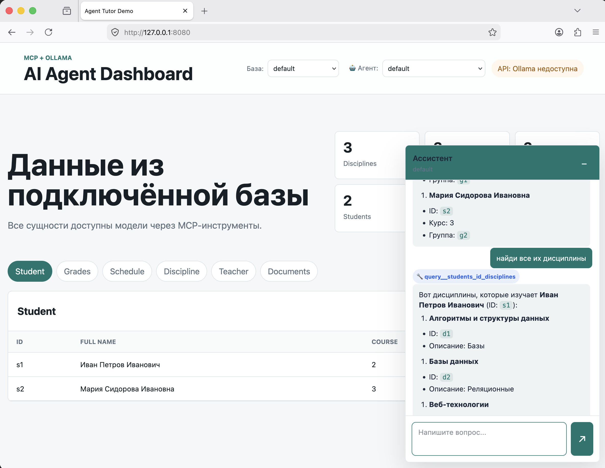 | 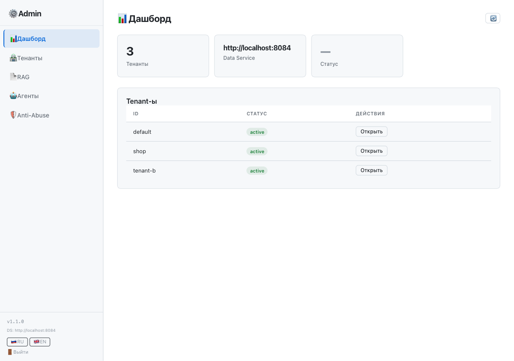 |

| API Swagger (api-service) | RAG Swagger (rag-service) |
|---|---|
| 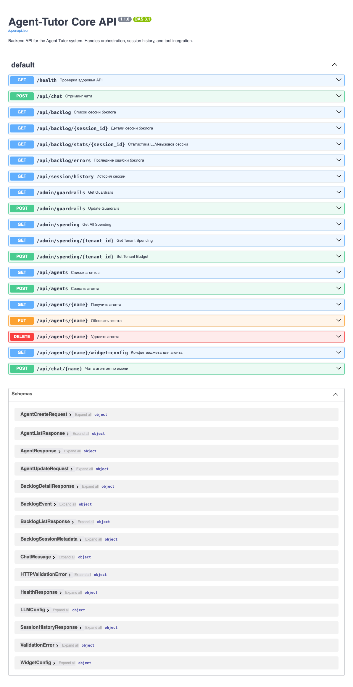 | 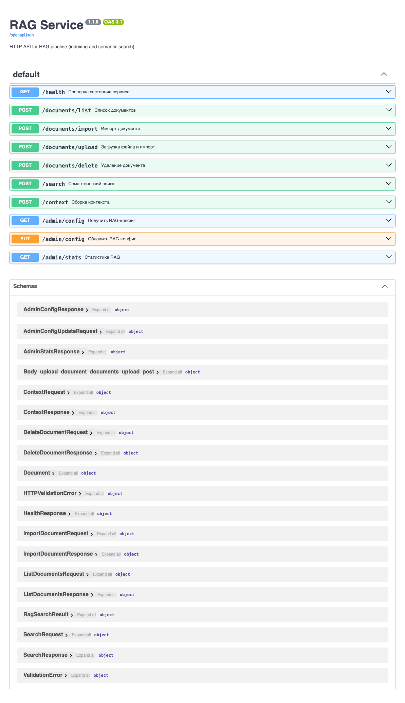 |

### Админ-панели

| Список клиентов (тенантов) | Настройка сущностей и эндпоинтов |
|---|---|
| 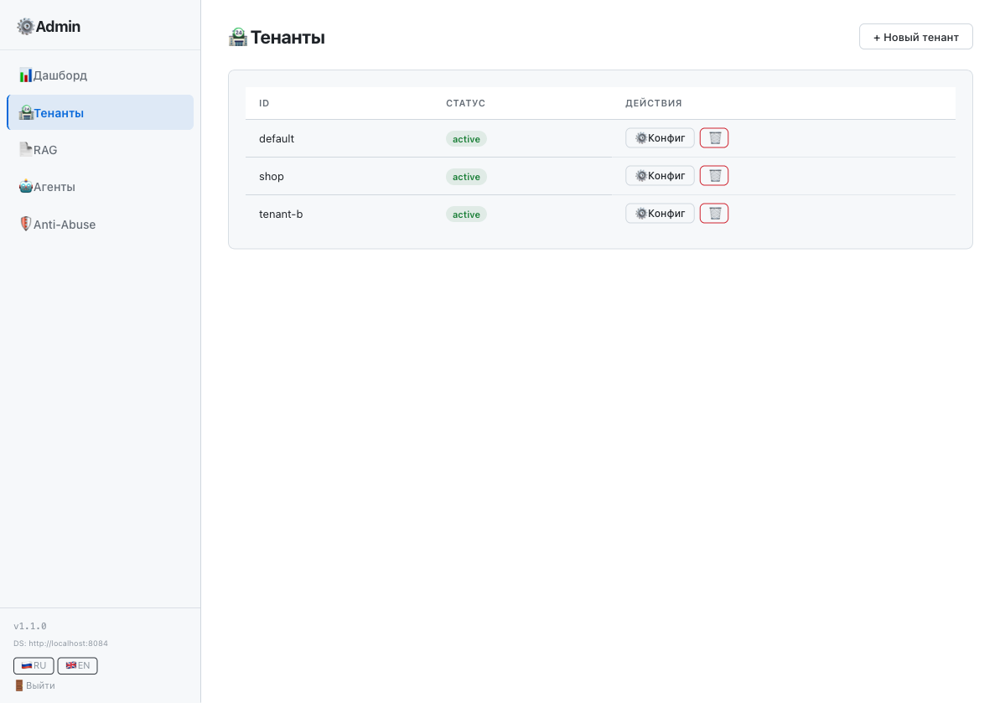 | 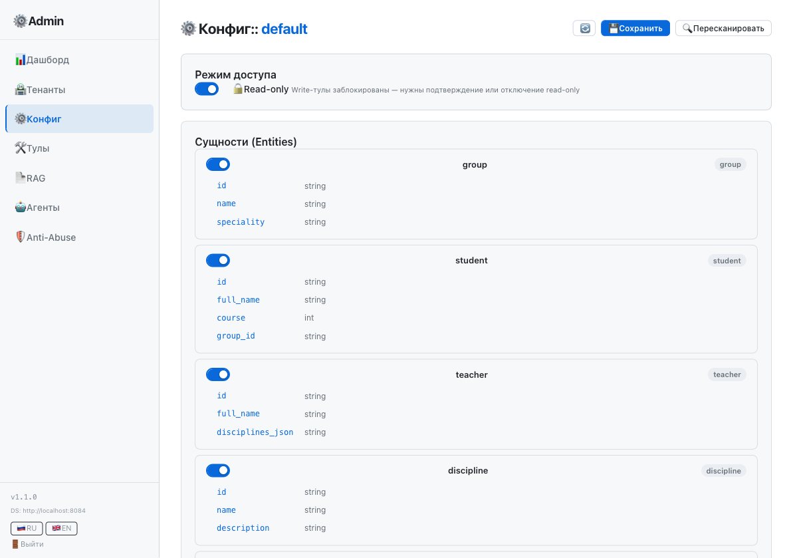 |

| Инструменты и подтверждение записи | Агенты |
|---|---|
| 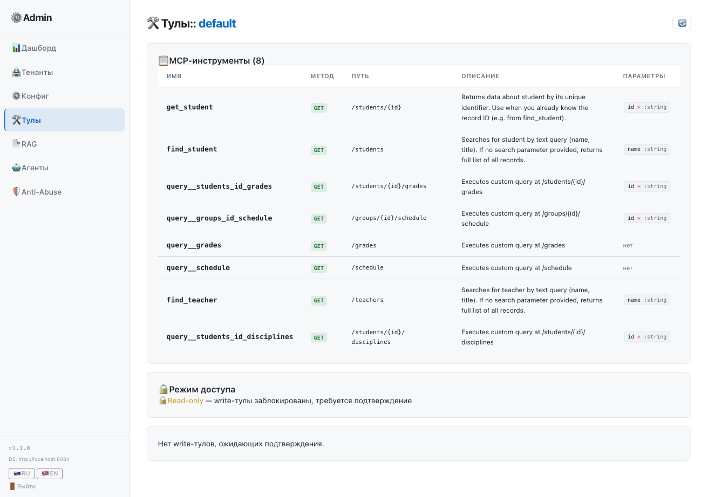 | 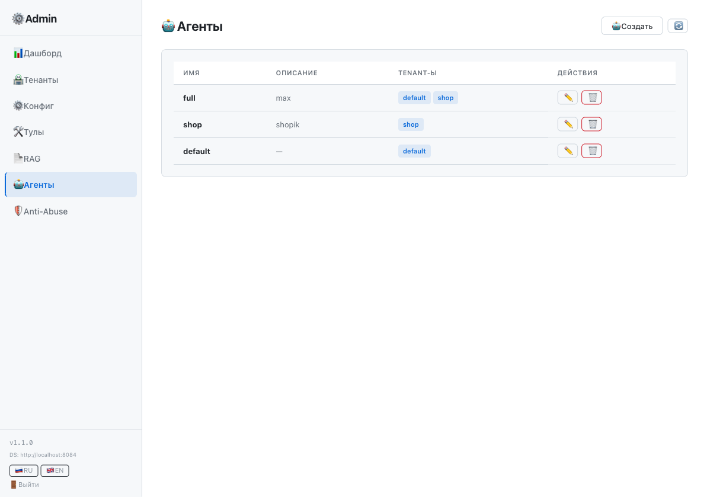 |

| Загрузка и поиск документов (RAG) | Настройки анти-спама |
|---|---|
| 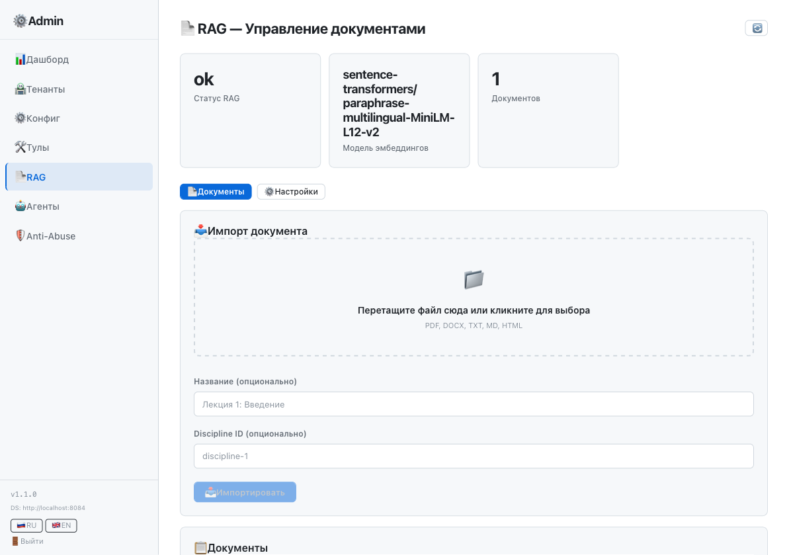 | 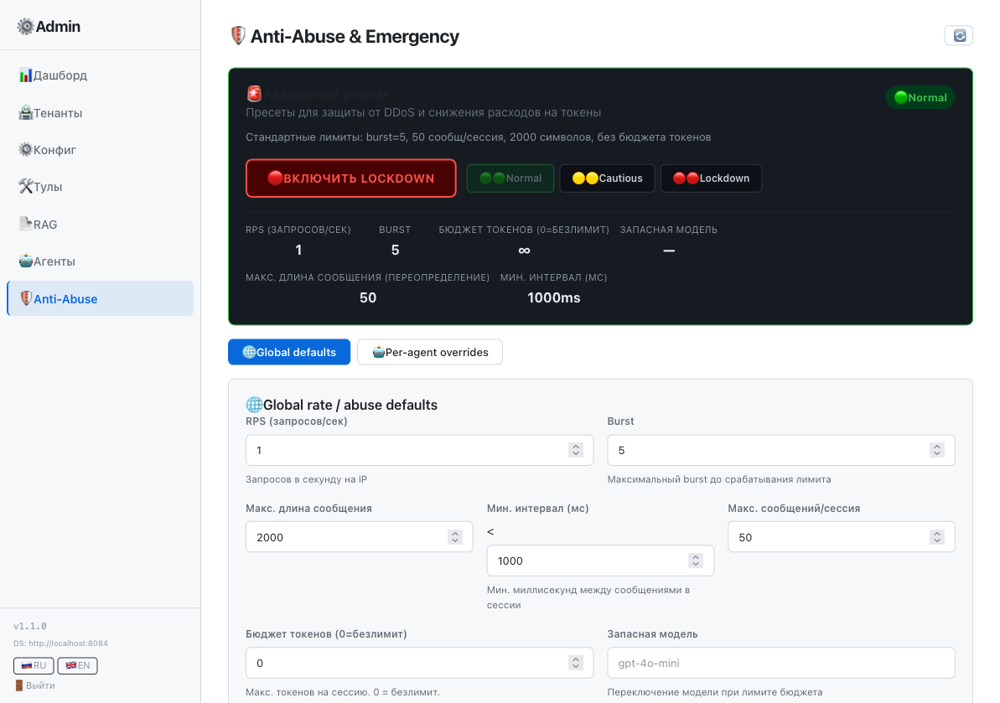 |

| Data Service Swagger | MCP Gateway — отладка инструментов |
|---|---|
| 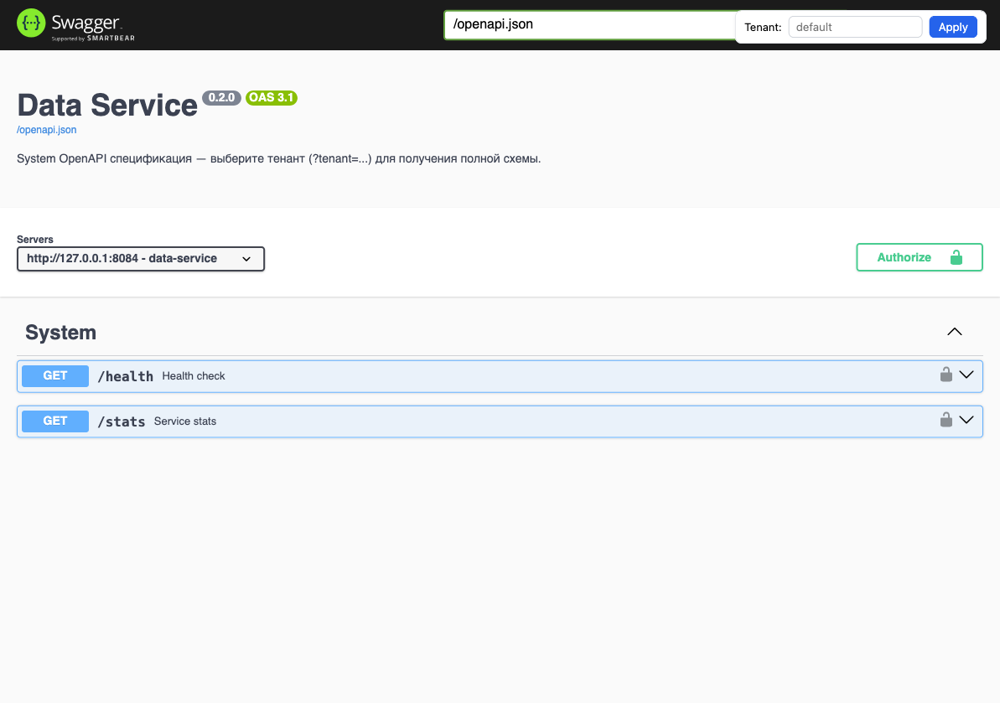 | 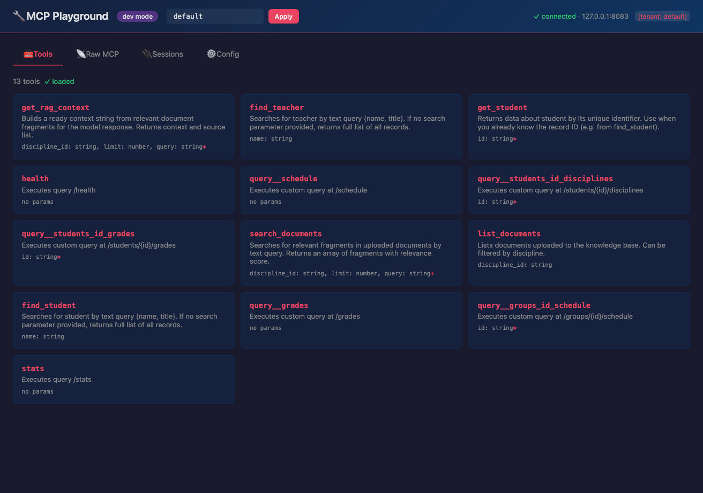 |

### Мониторинг

| Grafana (12 панелей) — сводка метрик всех сервисов |
|---|
| 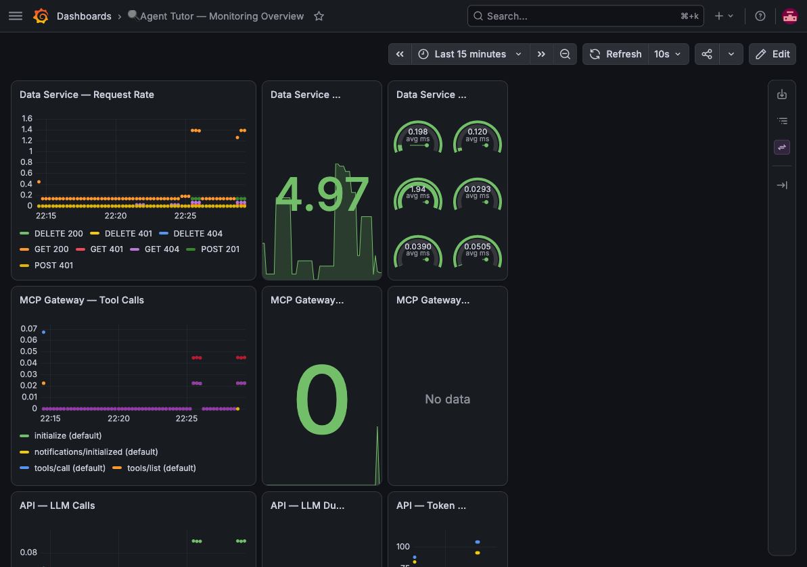 |

---

## Для кого это

У вас есть бизнес с базой данных (клиенты, товары, заказы, документы, расписание — что угодно). Вы хотите, чтобы посетители вашего сайта могли задавать вопросы и получать ответы на основе этих данных, и у вас есть некоторый уже собранный справочник FAQ. Чтобы вы **НЕ** писали для этого код и **НЕ** настраивали сложные интеграции. При этом RAG имеется при желании можно грузить нужные документы, можно подключить к живой базе данных и давать доступ агенту к реальным данным.

Подходит для:
- интернет-магазинов (каталог, цены, остатки)
- учебных заведений (расписание, студенты, оценки)
- медицинских центров (услуги, расписание врачей)
- любого бизнеса с SQL-базой

---

## Как это работает

**1. Подключение.** Указываете адрес вашей базы данных (SQLite или PostgreSQL). Никаких изменений в структуре базы — платформа сама разбирается в таблицах и связях.

**2. Автоматическая генерация.** Система читает схему базы и сама создаёт инструменты для агента: посмотреть список товаров, найти по названию, показать остатки, проверить заказ. Ничего писать не нужно.

**3. Настройка через админку.** Через веб-панель можно:
- отключить чувствительные таблицы (чтобы агент их не видел)
- переименовать их на понятные названия
- задать, какие модели ИИ использовать (можно свои, локальные)
- загрузить документы для поиска (прайсы, инструкции, FAQ)

**4. Готовый виджет на сайт.** Один тег `<script src="/embed/embed.js">` — и на сайте появляется окно чата. Shadow DOM, стили изолированы, дизайн настраивается (цвета, положение, размер). Никаких зависимостей. Виджет общается напрямую с api-service, промежуточных прокси не требуется.

**5. Посетители спрашивают.** Агент сам обращается к базе (через mcp-gateway → data-service), делает поиск по документам (RAG), собирает ответ и показывает его в чате. В реальном времени, потоково (токен за токеном), с поддержкой голосовых сообщений.

---

## Ключевые возможности

- **Работа с SQL-базой.** SQLite (файл или url) или PostgreSQL. Через Adapter Pattern можно добавить MySQL, MSSQL и другие СУБД — data-service generic, не привязан к конкретной БД
- **Только чтение по умолчанию.** Агент не может ничего записать или удалить. Запись включается вручную через админку и требует подтверждения каждого инструмента. (Есть функционал инструментов для записи в базу данных, но по умолчанию он надёжно выключен — `read_only: true`)
- **Гибридный поиск.** Агент сам обращается к живой базе (через точные SQL-запросы) и ищет по загруженным документам (PDF, DOCX, TXT и т.д.) — всё под вашим контролем
- **AI-модели любые.** Можно использовать локальную Ollama (приватно, если есть сервер с GPU), или любую облачную — Яндекс GPT, GigaChat, Mistral, OpenAI, DeepSeek, Qwen.
- **Мониторинг.** Панель Grafana с 12 графиками: сколько запросов, какие модели вызывались, сколько потрачено токенов, загрузка системы.
- **Несколько клиентов на одном сервере.** Можно подключить 10 разных баз, каждая со своими настройками и доступом — данные изолированы, отдельное создание агента с одной базой инструментов или несколькими (все гибко настраиваеться сразу из админ панели).

---

## Быстрый старт

```bash
git clone https://github.com/trash2bin/helperium
cd helperium
uv sync
./scripts/dev.sh start
# Открыть http://127.0.0.1:8080
```

Или через Docker:

```bash
docker compose up -d
```

---

## Чат-виджет на сайт

```html
<script src="https://ваш-сервер.com/embed/embed.js"
        data-agent="shop-assistant"
        data-api-base="https://ваш-сервер.com"
        data-title="Помощник"
        data-accent="#0f766e"
        data-greeting="Чем могу помочь?">
</script>
```

Никаких зависимостей, Shadow DOM — стили сайта не ломаются. Всё управляется через атрибуты: заголовок, цвет, положение, приветствие.

**Важно:** виджет ходит напрямую в api-service (`POST /api/chat/{agent}`), минуя demo/web. Tenant IDs берутся из конфига агента на сервере — виджет их не отправляет. Голосовой ввод по умолчанию в Telegram-стиле (зажать → запись, отпустить → отправить).

---

## Архитектура (кратко)

Шесть сервисов, работающих независимо. Можно запустить на одном сервере или распределить.

- **На Go:** data-service (работа с БД), mcp-gateway (MCP-шлюз), admin-dashboard (админка) — где важна скорость.
- **На Python:** api-service (оркестратор агента, виджет, AI-модели, voice), rag-service (поиск по документам) — где важна гибкость.

**Важно:** `demo/web` (прокси-сервер) — это рудимент MVP, используется только для локальной разработки. В production-сценарии виджет ходит напрямую в api-service.

Изоляция между клиентами на трёх уровнях: отдельные файлы баз, раздельные инструменты, раздельные заголовки запросов. Проверено тестами.

**Важно:** data-service не умеет semantic search. Он поддерживает только WHERE с LIKE/равенством по полям и custom_queries (заранее утверждённые SELECT-запросы). LLM сама решает, какой инструмент вызвать.

---

## Развёртывание

### Docker (рекомендуется)

```bash
docker compose up -d                              # все сервисы
docker compose --profile prod up -d               # + HTTPS через Caddy
docker compose --profile monitoring up -d         # + Prometheus + Grafana
```

### На сервере

```
1. git clone, настроить .env (адрес БД, ключ AI-модели)
2. docker compose up -d
3. Зарегистрировать клиента через CLI
4. Админка: загрузить документы, настроить агента, утвердить инструменты
5. Виджет на сайт
6. Мониторинг: http://localhost:3000 (Grafana)
```

---

## Документация

| Документ | Описание |
|---|---|
| [`AGENTS.md`](AGENTS.md) | Технический паспорт проекта для ии агентов и разработчиков |
| [`doc/FINAL_TASK.md`](doc/FINAL_TASK.md) | План развития до релизной версии |
| [`doc/RUNBOOK.md`](doc/RUNBOOK.md) | Шпаргалка по деплою |
| [`doc/PENTEST-CHEK.md`](doc/PENTEST-CHEK.md) | Чек-лист безопасности |
| [`.env.example`](.env.example) | Все переменные окружения |

---

## Лицензия

Платформа распространяется под Mozilla Public License 2.0 (MPL 2.0). Это значит:
- Вы можете использовать её на своём сервере для любых целей
- Вы можете модифицировать код для личного использования
- Изменения файлов платформы, если вы их распространяете публично (коммерчески), должны быть доступны под той же лицензией

**Коммерческие модификации самой платформы** (кастомные доработки под конкретного клиента, сборки, интеграции с платными системами) контролирует автор проекта.

Проект также использует [Contributor License Agreement](CLA.md): код, присланный через pull request, может быть использован автором проекта в любых целях, включая коммерческие и проприетарные версии. По усмотрению автора активные (доверенные) контрибьюторы могут получить право на коммерческое использование кода в качестве поощрения за вклад в проект.
