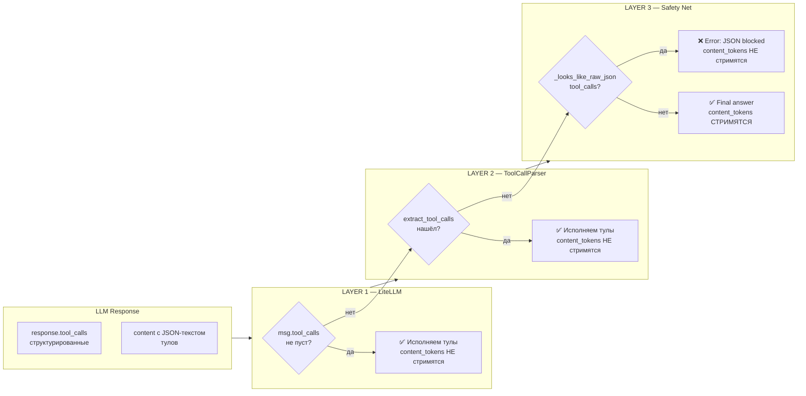

# Tool Call Safety Layers — защита от утечки сырого JSON пользователю

## Контекст

Некоторые LLM (MiniMax, локальные Ollama-модели, Llama) **не умеют возвращать структурированные tool_calls**. Они пишут JSON-тулы как обычный текст в `content`. Без защиты этот JSON улетает пользователю:

```
{"name": "get_catalog_product", "arguments":{"id": 1059}}
{"name": "get_catalog_product", "arguments":{"id": 1060}}
```

Это **security issue**: модель показывает внутреннее состояние, пользователь видит сырые данные. Три уровня защиты предотвращают это.

## Архитектура (3 слоя)



### Layer 1 — LiteLLM `add_function_to_prompt`

**Где:** `api-service/src/api_service/agent/litellm_provider.py`

**Что делает:** глобальный флаг `litellm.add_function_to_prompt = True` включает конвертацию `tools/{'function':{...}}` в текстовый промпт для моделей без нативной поддержки. LiteLLM сама инжектит описание тулов в system prompt и **парсит ответ обратно** в `msg.tool_calls`.

**Когда срабатывает:** для любых моделей где `litellm.supports_function_calling(model)` → `False`.

**Лог:** `[LITELLM_PROVIDER] Model returned N tool_calls via native/add_function_to_prompt path`

### Layer 2 — ToolCallParser (fallback)

**Где:** `api-service/src/api_service/agent/tool_parser.py`, вызов в `stages.py`

**Что делает:** если LiteLLM не распарсила тулы (вернула JSON текстом в `content`), `ToolCallParser.extract_tool_calls()` парсит его вручную. Поддержка форматов:

| Формат | Пример |
|---|---|
| JSON-массив | `[{"name": "x", "arguments": {"id": 1}}]` |
| NDJSON (построчно) | `{"name": "x"}\n{"name": "y"}` |
| OpenAI-стиль | `[{"function": {"name": "x", "arguments": "{}"}}]` |
| Markdown code block | `` ```json [{...}] ``` `` |
| Tool Calls: префикс | `Tool Calls: [{...}]` |
| <invoke> теги | `<invoke name="x">...</invoke>` |
| Обёртка | `{"tool_calls": [{...}]}` |

**Когда срабатывает:** когда `response.tool_calls` пуст, но `response.content` содержит JSON тула.

**Лог:** `[LLM_STAGE][TOOL_PARSER] Extracted N tool calls from JSON text (LiteLLM didn't parse them, fallback parser caught them)`

### Layer 3 — Safety Net (`_looks_like_raw_json_tool_calls`)

**Где:** `api-service/src/api_service/agent/stages.py`, функция `_looks_like_raw_json_tool_calls()`

**Что делает:** эвристическая проверка контента на наличие `{"name": ... "arguments": ...}` или `[...{"name":...}]`. Если контент похож на JSON тула — **не пускаем `final`**, вместо этого шлём `error`. Это последняя линия.

**Когда срабатывает:** когда LAYER 1 и LAYER 2 не справились, но контент содержит:
- `{"name": "...", "arguments": {...}}` (NDJSON)
- `[{...несколько тулов...}]` (массив)
- `Tool Calls: [...]`
- `{"tool_calls": [...]}`

**Лог:** `[LLM_STAGE][SAFETY_NET] BLOCKED final: content looks like raw JSON tool calls (LiteLLM+ToolParser both failed).`

**Что блокирует НЕ ЛОВИТ** (не должно): обычный текст, `{"status": "ok"}`, `curl -d '{"name":"test"}'`.

### Token streaming guard

**Где:** `stages.py`, весь outcome-блок в `LLMStage.run()`

Критическое правило: `content_tokens` **стримятся ТОЛЬКО в ветке `final`** — после того как все три слоя подтвердили что это настоящий ответ, не JSON тула.

```python
# НЕПРАВИЛЬНО (было — стримилось ДО проверки):
for token in response.content_tokens:
    yield AgentEvent("token", {"data": token})

# ПРАВИЛЬНО (стало — только после safe_final):
if response.tool_calls:       # LAYER 1 → не стримим
elif response.content:
    if parsed:                # LAYER 2 → не стримим
    if _looks_like...:        # LAYER 3 → не стримим, error
    # ТОЛЬКО ТУТ:
    for token in ...:         # true final → стримим
```

### Iteration не расходуется на tool-round

**Где:** `api-service/src/api_service/agent/pipeline.py`

```python
if not ctx.had_tool_calls_this_iteration:
    ctx.turn.iteration += 1
ctx.had_tool_calls_this_iteration = False
```

Если в раунде были tool_calls (любой из 3 слоёв), iteration не инкрементируется. Это предотвращает ситуацию когда последние тулы срезаются лимитом и JSON остаётся непонятым.

## Добавление нового слоя/формата

1. **Новый формат в LAYER 2** — расширить `ToolCallParser._extract_json_tool_calls()`:
   - Добавить regex/парсинг для нового формата
   - Добавить тест в `test_tool_parser_extensive.py`
   - Добавить фабрику в `llm_response` если формата нет

2. **Новый эвристик в LAYER 3** — расширить `_looks_like_raw_json_tool_calls()`:
   - Добавить проверку на новый паттерн
   - Добавить unit-тест в `TestSafetyNet`

3. **Напрямую через LiteLLM** — если модель научили писать тулы в другом формате, проверить
   `litellm.supports_function_calling(model)` — может модель уже поддерживает нативно.

## Известные проблемы (wontfix / low prio)

- Модель может написать текст + JSON тула **в одном ответе**. Парсер найдёт тулы и выполнит их, текст будет добавлен в history но не показан пользователю. Wontfix — это ближе к правильному поведению чем JSON в чате.
- Safety net может **ложно сработать** на `curl -d '{"name":"test"}'`. На практике не было — обёрни в тест если появится.

## Тесты

Все 53 теста в `test_tool_parser_extensive.py` + 5 в `test_json_tool_calls_parsing.py` покрывают:
- Все форматы NDJSON/массив/markdown/inline
- Утечку токенов в трёх сценариях
- Iteration budget на tool-round
- OpenAPI-style function wrapper
