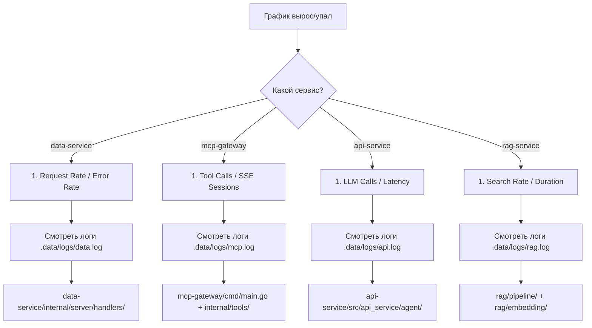

# 📊 Monitoring & Observability

## Быстрый старт

```bash
# Открыть Grafana
open http://localhost:3000

# Дашборд «Helperium — Full Monitoring»
# Логин/пароль: admin / admin

# Prometheus
open http://localhost:9090

# JSON-логи каждого сервиса
tail -f .data/logs/{data,mcp,api,rag,admin,web}.log
```

---

## Архитектура

```
┌──────────────────────────────────────────────┐
│  Grafana (:3000)   ◄──  Prometheus (:9090)   │
│  дашборд + алерты       │                    │
└──────────────────────────│────────────────────┘
                           │ scrape /metrics (15s)
       ┌───────────────────┼───────────────────┐
       ▼                   ▼                   ▼
┌────────────┐   ┌──────────────┐   ┌──────────────┐
│ data-service│  │ mcp-gateway  │  │ api-service   │
│ :8084      │   │ :8083        │  │ :8081         │
├────────────┤   ├──────────────┤   ├──────────────┤
│ admin-dash │   │ rag-service  │   │ web-proxy    │
│ :8085      │   │ :8082        │   │ :8080        │
└────────────┘   └──────────────┘   └──────────────┘
```

Каждый сервис экспортирует Prometheus-метрики на `/metrics`.
Prometheus собирает их каждые 15 секунд.
Grafana визуализирует данные с Prometheus-датасорса.

---

## Панели дашборда — что значат и куда смотреть

### 🟢 Service Health

| Панель | Что показывает | Норма | Тревога |
|---|---|---|---|
| Data Service | UP/DOWN по `up{job="data-service"}` | ✅ UP | ❌ DOWN |
| MCP Gateway | UP/DOWN | ✅ UP | ❌ DOWN |
| API Service | UP/DOWN | ✅ UP | ❌ DOWN |
| Admin Dashboard | UP/DOWN | ✅ UP | ❌ DOWN |
| RAG Service | UP/DOWN | ✅ UP | ❌ DOWN |
| Web Proxy | Prometheus alive | ✅ UP | ❌ DOWN |

**При DOWN:** проверить `./scripts/dev.sh status` / `docker ps`. Смотреть `.data/logs/*.log`.

### 📡 Data Service

| Панель | Метрика | Ед.изм. | Норма | Тревога |
|---|---|---|---|---|
| Request Rate | `rate(data_requests_total[1m])` | req/s | <50 | >200 |
| Avg DB Query Duration | `rate(data_db_query_duration_ms_sum[1m]) / rate(data_db_query_duration_ms_count[1m])` | ms | <10ms | >50ms → >500ms |
| Error Rate (4xx+5xx) | `rate(data_requests_total{status=~"4..|5.."}[1m])` | req/s | <1% | >5% |
| Request Duration (p99) | `histogram_quantile(0.99, sum(rate(data_request_duration_ms_bucket[5m])) by (le))` | ms | <100ms | >200ms → >500ms |

**Где копать при аномалиях:**
- **Рост длительности** → `data-service/internal/server/tenant.go` (рутер), `data-service/internal/datasource/postgres_adapter.go` (PG-запросы)
- **Ошибки 404** → неверный путь/entity в конфиге tenant'а `helperium-go/config/types.go`
- **Ошибки 500** → баг в generic-хендлере `data-service/internal/server/handlers/default.go`

### 🔌 MCP Gateway

| Панель | Метрика | Ед.изм. | Норма | Тревога |
|---|---|---|---|---|
| Tool Calls Rate | `rate(mcp_tool_calls_total[1m])` | req/s | <10 | >50 |
| Active SSE Sessions | `sum(mcp_sessions_active)` | шт | <100 | >500 / MaxSessions=1000 |
| Rate Limit Hits | `rate(mcp_rate_limit_hits_total[5m])` | req/s | 0 | >0 |
| Errors (tool calls) | `mcp_tool_calls_total{status!="ok"}` | шт | 0 | >0 |

**Где копать при аномалиях:**
- **Rate limit >0** → увеличить RPS/burst в `mcp-gateway/cmd/ratelimit.go`
- **Сессии падают** → `mcp-gateway/cmd/main.go` (SSE-хендлер, idle-таймауты)
- **Tool call errors** → `mcp-gateway/internal/tools/` (маппинг инструментов), `mcp-gateway/internal/httpclient/client.go` (HTTP к data-service)

### 🧠 API — LLM & Chat

| Панель | Метрика | Ед.изм. | Норма | Тревога |
|---|---|---|---|---|
| LLM Calls Rate | `rate(llm_calls_total[1m])` | req/s | <1 | >5 |
| LLM Duration (avg) | `rate(llm_duration_ms_sum[1m]) / rate(llm_duration_ms_count[1m]) / 1000` | s | <5s | >15s → >30s |
| Token Usage Rate | `rate(llm_token_usage_total[1m])` | tok/s | — | — |
| LLM Cost | `rate(llm_cost_total[1m])` | USD/min | <$0.01 | >$0.10 |
| Active Chat Sessions | `sum(rate(chat_sessions_total[5m])) * 300` | шт | — | — |
| Abuse Blocks | `rate(abuse_blocked_total[1m])` | req/s | 0 | >0 |
| Chat Message Rate | `rate(chat_messages_total[1m])` | msg/s | — | — |
| Backlog Queue | `backlog_records_total - backlog_records_created` | шт | 0 | >10 |

**Где копать при аномалиях:**
- **LLM долгий** → `api-service/src/api_service/agent/orchestrator.py` (цикл _run_turn), провайдер LiteLLM
- **Cost растёт** → сменить модель/провайдера в `api-service/src/api_service/agent/llm_provider.py`
- **Abuse blocks** → `api-service/src/api_service/agent/guard_checker.py` (prompt injection, repeated text)
- **Backlog растёт** → worker'ы не успевают, `api-service/src/api_service/agent/backlog.py`

### 📄 RAG Service

| Панель | Метрика | Ед.изм. | Норма | Тревога |
|---|---|---|---|---|
| Documents & Chunks | `rag_documents_total`, `rag_chunks_total` | шт | — | — |
| ChromaDB Size | `rag_chroma_size_bytes / 1048576` | MB | <500 | >1000 |
| Search Rate | `rate(rag_searches_total[1m])` | req/s | <10 | >50 |
| Search p95 Duration | `histogram_quantile(0.95, ...)` | ms | <100 | >500 |
| Cache Hit Ratio | `rate(rag_cache_hits[5m]) / rate(rag_cache_hits + rag_cache_misses)[5m]` | % | >50% | <30% |
| Import Duration (avg) | `rate(rag_import_duration_ms_sum[1m]) / rate(rag_import_duration_ms_count[1m]) / 1000` | s | <2s | >10s |
| Search Error Rate | `rate(rag_searches_total{status="error"}[5m])` | err/s | 0 | >0 |

**Где копать при аномалиях:**
- **Search долгий** → `rag/pipeline/pipeline.py` (пиплайн), `rag/embedding/` (эмбеддер)
- **Cache ratio низкий** → частые уникальные запросы, нормально
- **Import долгий** → `rag/pipeline/pipeline.py` (чанкинг), размер документа
- **Search errors** → ChromaDB connection, `rag/cache/local.py`

### ⚙️ Admin Dashboard

| Панель | Метрика | Ед.изм. | Норма | Тревога |
|---|---|---|---|---|
| Request Rate | `rate(admin_requests_total[1m])` | req/s | <5 | >20 |
| Admin Error Rate | `rate(admin_requests_total{status=~"4..|5.."}[5m])` | err/s | 0 | >0 |

---

## Метрики — справочник для PromQL

### data-service (`:8084/metrics`)

| Метрика | Тип | Лейблы | Описание |
|---|---|---|---|
| `data_requests_total` | Counter | `operation, status, entity, tenant` | Все HTTP-запросы |
| `data_request_duration_ms` | Histogram | `operation, entity` | Длительность HTTP |
| `data_db_query_duration_ms` | Histogram | `tenant` | Длительность SQL-запроса |

### mcp-gateway (`:8083/metrics`)

| Метрика | Тип | Лейблы | Описание |
|---|---|---|---|
| `mcp_tool_calls_total` | Counter | `tool, status, tenant` | Вызовы MCP-инструментов |
| `mcp_sessions_active` | Gauge | `tenant` | Активные SSE-сессии |
| `mcp_rate_limit_hits_total` | Counter | `tenant` | Заблокированные rate-limiter'ом |

### api-service (`:8081/metrics`)

| Метрика | Тип | Лейблы | Описание |
|---|---|---|---|
| `chat_sessions_total` | Counter | `tenant` | Созданные сессии |
| `chat_messages_total` | Counter | `status` | Сообщения (ok/blocked/error) |
| `llm_calls_total` | Counter | `model, provider` | Вызовы LLM |
| `llm_duration_ms` | Histogram | — | Длительность LLM-вызова |
| `llm_token_usage_total` | Counter | `type` | Токены (prompt/completion/total) |
| `llm_cost_total` | Counter | — | Стоимость LLM в USD |
| `abuse_blocked_total` | Counter | `reason` | Блокировки анти-абуза |
| `backlog_records_total` | Counter | `type` | Всего бэклог-задач (turn_start, llm_call, tool_call, tool_result) |
| `backlog_records_created` | Gauge | `type` | ⚠️ auto-generated timestamp от Prometheus. **Не использовать как счётчик!** |

### rag-service (`:8082/metrics`)

| Метрика | Тип | Лейблы | Описание |
|---|---|---|---|
| `rag_documents_total` | Gauge | — | Всего документов в SQLite |
| `rag_chunks_total` | Gauge | — | Всего чанков в SQLite |
| `rag_chroma_size_bytes` | Gauge | — | Размер ChromaDB на диске |
| `rag_searches_total` | Counter | `status` | Поисковых запросов |
| `rag_search_duration_ms` | Histogram | — | Длительность поиска |
| `rag_cache_entries` | Gauge | — | Размер кэша поиска |
| `rag_cache_hits_total` | Counter | — | Попаданий в кэш |
| `rag_cache_misses_total` | Counter | — | Промахов кэша |
| `rag_import_duration_ms` | Histogram | — | Длительность импорта документа |

### admin-dashboard (`:8085/metrics`)

| Метрика | Тип | Лейблы | Описание |
|---|---|---|---|
| `admin_requests_total` | Counter | `path, status` | HTTP-запросы админки |

---

## Алерты (TODO)

В будущем можно настроить алерты в Grafana Alerting:

```yaml
# Пример алерта для долгих DB запросов
- name: Slow DB Queries
  alert: avg_over_time(rate(data_db_query_duration_ms_sum[5m]) / rate(data_db_query_duration_ms_count[5m])[5m]) > 1000
  for: 5m
  message: "DB queries avg >1s for 5 minutes on data-service"
```

---

## Поиск виновника проблем



---

## Где что лежит

| Файл | Назначение |
|---|---|
| `docker/prometheus/prometheus.yml` | Конфигурация Prometheus (таргеты) |
| `docker/grafana/datasources/datasource.yml` | Provisioned datasource |
| `docker/grafana/dashboards/helperium-overview.json` | **Дашборд** (этот файл) |
| `docker/grafana/dashboards/dashboard.yml` | Provider для автозагрузки |
| `.data/logs/{svc}.log` | JSON-логи сервисов |
| `.env` | RAG_ADMIN_TOKEN, ADMIN_TOKEN |
| `doc/monitoring.md` | **Эта документация** |
